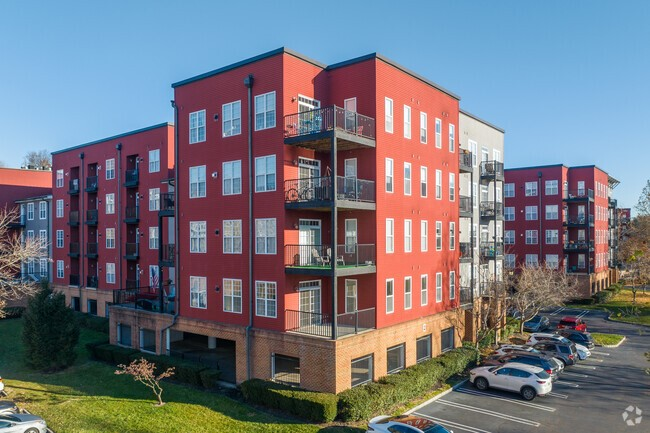
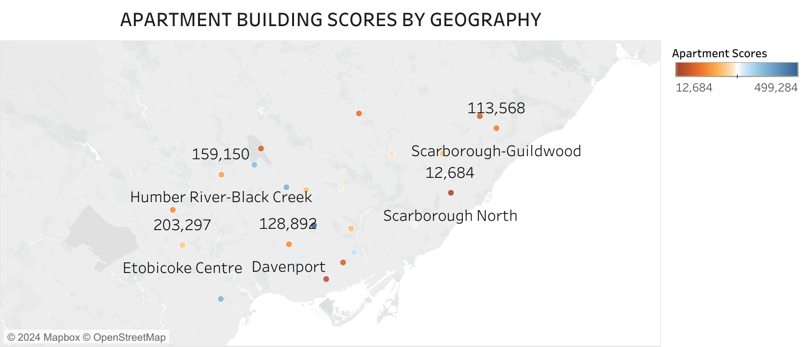

##  Apartment Building Evaluation in Toronto.

_This is an Excel Analysis on the apartment building evaluation scores from the year 2017 to 2021 that are registered in Toronto with RentSafeTO. The data was visualized with **Tableau**._

## Introduction
**RentSafeTO** aims to ensure that building owners and operators comply with building maintenance standards through initiatives like evaluations and that tenants understand their rights and responsibilities. Apartment Building Standards is a bylaw enforcement program established in 2017 to ensure that owners and operators of apartment buildings with three or more storeys or 10 or more units comply with building maintenance standards. 

##  Skills Concepts demonstrated:
The following analysis skills were incorporated:

Data Cleaning, Data Management, KPI Metrics, Data visualization.

##  Problem Statement
During evaluations, Bylaw Enforcement Officers inspect common areas, mechanical and security systems, parking and exterior grounds. Each item is inspected and assigned a score from one to five, with one being the lowest and five being the highest. If an item is not applicable to the building at the time of evaluation, the score will show as blank in the dataset.

However, based on the given dataset the following questions were answered:

1. What were the common errors / issues you encountered with the data?
2. What is the evaluation scores based on property type?
3. What is the evaluation scores based on year registered on property?
4. What is the building scores based on ward areas?
5. What is the apartment building scores distribution by geography?
6. What is the apartment building scores based on year of building?

 _**Disclaimer** The dataset was downloaded from RentSafeTO website._

## Data Cleaning/Transformation
The common error associated with this dataset include:

-	Blank Spaces
-	Null figures
-	Incomplete Rows and Columns
-	Inconsistency with Data about information given

  To clean the dataset given using Microsoft Excel, i took the following steps:
  
1.	I created  a consistency with all the Headings in the column. Selected the heading row and made them bold using _Ctrl + B_.
2.	I removed all blank Spaces. Clicked on _Ctrl + A_, then _Ctrl + B_. Go to _Special_, click on _Blanks_, all blank Spaces were highlighted. Right click on any of the blank spaces, then click on _Shift cells up_.
3.	I replaced all **N/A**  values with **0**. I clicked on the columns that contain value, then i clicked on _Ctrl + H > Find and Replace_. Then i replaced all values with 0.
4.	I arranged all the dataset alphabetically by the Ward names.I clicked on the column containing the ward names, then  on the _Home tab_ in the editing space, click on _Sort and Filter_ > A-Z.
5.	I formatted the table structure.

# Analysis
In other to be able to analyse my cleaned data and get meaningful insights from it, i decided to use the _Key Performers Indicators_ by creating a new rule in the _conditional formatting_ tab based on the appartment scores given in different ward areas by the year of registration. Also, i used the _Pivot Table_ to be able to summarize the average scores gotten during evaluation by different ward areas based on the years. Based on the average scores gotten per each year from the evaluation scores of the different ward areas, the years with high evaluation was able to known.
The year with highest scores indicates a **green** dot while the year with the average scores indicates **yellow**  and finally the year with the lowest scores indicates **red**. All of this are based on the ward areas, therefore all the different ward areas have there different values and average scores. I also inserted **slicers** to be able to shuffle through the different ward areas,to understand the average distribution of scores per year.

Average score for Beaches East-York| Average score for Daven Port         |       Average score for Don Valley East   
|-----------------------:|:-----------------------------:|:------------------------------------------------------------|
     |     |           

# Visualization
After cleaning and analysing the data using pivot tables and KPIs, i went over to Tableau to create a visual report of this dataset.

.png)

## 1. Building Scores in Ward Areas and Geography. 

The Central and Southern region of Toronto have the highest evaluation scores compared to the Northern region, with Toronto St-Pual’s having the total highest score of 499,284 and Scarborough North having the lowest evaluation score of 12,684. This significant difference can be attributed to the Southern region been more densely populated and it have most major roads and institutions compared to the North. However, more buildings are being built in these areas and are highly maintained due to high demand. The increase in property and evaluation scores have also influenced some parts of the Central region that is close to the South, hence the increase in evaluation scores in some wards in the central region. 

 | 
|---------------------------------:|:--------------------------------|

## 2. Evaluation Based on Property Type
Private owned properties have the highest average evaluation score of 84.76% compared to the Toronto community Housing(TCHC) and the Social housing that have low scores of 8.95% and 6.29%. This clearly proves that private owned apartments are highly maintained compared to the Government owned apartments. However, this can affect the level at which people rent apartments owned by the government. Also, tenants are more satisfied with the maintenance and also the facilities available in private owned properties compared to properties owned by the government.

## 3. Evaluation Based On Year Registered
In 2017, the evaluation scores for all the types of property increased significantly especially for Private owned properties. Also, note that the apartment building standards bylaw enforcement program was established in 2017 to ensure that owners and operators of apartment buildings. This increase can be due to most apartments been registered and meeting up to the specific standards at the start of the evaluation process.

However, there was a great decrease in 2018 and in subsequent years which can be attributed to most buildings been registered and evaluated the previous year. This can however show that new buildings have not being built over the years. Also, if evaluation is done every 3yrs, what could have affected the scores in 2020 and 2023 to be this low?

## 4. Building Scores to Year of Building Built.
Based on the year the buildings were built, the year 1960 is recorded as the year with the highest number of building scores of 510,192 and 1889 as the year with the lowest score of 397. In 1889, it is possible that architectural advancements have not really began hence the low evaluation score. It can also be due to how old these buildings have turned over the years. 

However, what could have cause the buildings built in 1960 to have such high evaluation sores? Could this be because of the type of building built or the materials used or even the structures and pattern of buildings built this particular year?
Also, the scores of buildings built in subsequent years dropped. What could also have caused this drastic drop in the evaluation scores for buildings later than 1960?

## Recomendations:
-	All buildings must have the year the building was built, before evaluation must be carried out and recorded.
-	Certain Criteria should be met before some buildings are Evaluated, to avoid too much data on building that do not meet most of the Evaluation criteria.
-	Buildings that do not have any specified location and ward names should also not be inserted in the dataset, this will help to build consistency.
-	More attention should be given to buildings in the Northern region to make sure that there is a balance in all regions based on apartment evaluation and also developmental growth.
-	Old buildings can be re-built or renovated so that there is continuity in the evaluation processes and also help in the developmental growth in Toronto.
  

